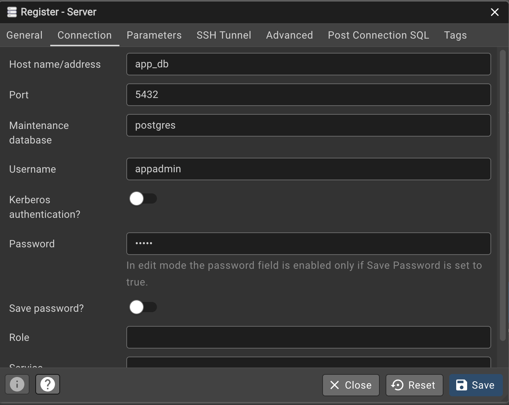

This is just a quick way for us to install and run postgres on different machines.

## Docker setup

- There are two apps currently `app_db` and `app_pgadmin`
- `app_data` constiner installs postgres which is our DB server
- `pgadmin` lets you view and query the DB
- This is a dev/test envoriment so password are stored in plaintext

## Installation

- You can install docker from <a href="https://docs.docker.com/desktop/">here</a>
- At the bottom of the page you'll see "Install Docker Desktop
  Install Docker Desktop on Mac, Windows, or Linux."

## Manage containers

Quick overview for you who hasn't worked with docker before

- After docker is installed have access to the following commands:
- `docker compose -f compose.dev.yml up -d` // start (`-d` flag means detactched, omit if you want live logs)
- `docker compose -f compose.dev.yml down` // kill
- `docker logs app_db` // postgres logs (if container is running)
- `docker logs app_pgadmin` // pgadmin logs (if container is running)

> Note, the commands containing "compose" only works if you're in `/docker` so the `compose.dev.yml` file is in your current directory.

## Access

- The database is exposed on 0.0.0.0:5432 (localhost:5432)
- PGAdmin is exposed on 0.0.0.0:5050 (<a href="http://localhost:5050">localhost:5050</a>)

You can connect to the database directly from CLI or with a programming language.

Here are the credentials:

```DB creds
Username:   appadmin
Password:   admin
```

## Web view

- If you want to see the state of db or query it directly, you can use pgadmin which is a seperate application from postgres
- When the container is running you should be able to reach it in your web-browser from `localhost:5050`

Here are credentials you'll need to sign in:

```PGAdmin creds
Email:      admin@ntnu.no
Password:   admin
```

- After you sign in, you can connect to the db by clicking `Add new server`
- Go to `Connection` tab, and fill in exactly like this:



<a href="https://www.youtube.com/watch?v=Gjnup-PuquQ">Docker in 100 seconds </a> if u wanna learn more :)
